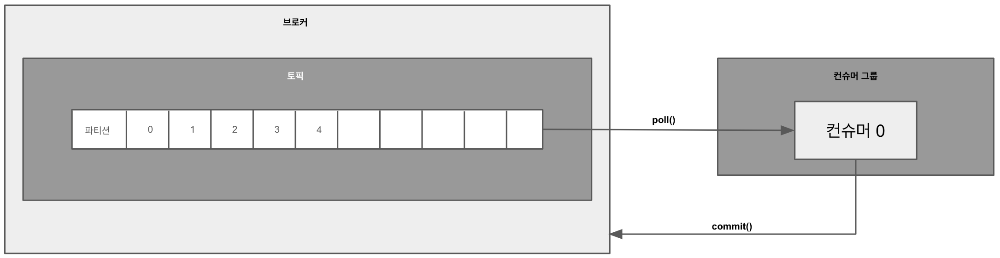

# 클라이언트

카프카 클러스터는 명령을 내리거나 데이터를 송수신하기 위해 카프카 클라이언트 라이브러리는 카프카 프로듀서, 컨슈머, 어드민 클라이언트를 제공하는 카프카 클라이언트를 사용하여 애플리케이션을 개발한다. 

## 프로듀서 API

### 프로듀서 주요 역할

- 카프카에 데이터를 선언하고 **브로커의 특정 토픽 파티션**에 데이터를 전송.
- **리더 파티션**을 가진 브로커와 직접 통신.
- 데이터를 직렬화하여 다양한 데이터 유형(Java 기본형 및 참조형 데이터, 텍스트, 이미지, 동영상 등)을 전송 가능.

### 프로듀서 주요 처리 단계

1. **Partitioner**
  - 메시지 키에 따라 데이터의 파티션을 결정.
  - 메시지 키가 없을 경우:
    - `RoundRobinPartitioner`: 파티션을 순차적으로 할당 (배치 빈도 낮음).
    - `UniformStickyPartitioner`: 배치로 묶인 데이터를 동일한 파티션에 전송 (기본값, Kafka 2.5.0 이상).
2. **Accumulator**
  - 데이터를 버퍼로 쌓아 배치로 묶어 전송하여 처리량 최적화.
3. **Sender**
  - 배치 데이터를 가져와 카프카 브로커로 전송.

### 압축 옵션

- 지원 압축 방식: `gzip`, `snappy`, `lz4`, `zstd`
- 압축으로 네트워크 처리량 절감 가능하지만, CPU 및 메모리 사용량 증가.

---

### 프로듀서 주요 옵션

### 필수 옵션

- **`bootstrap.servers`**: 데이터를 전송할 카프카 브로커의 주소. (호스트:포트)
  - hostname:port 를 1개 이상 작성한다. 2개 이상 브로커 정보를 입력하여 일부 브로커에 이슈가 발생하더라도 접속하는데에 이슈가 없도록 설정 가능하다.
- **`key.serializer`**: 메시지 키 직렬화 클래스.
- **`value.serializer`**: 메시지 값 직렬화 클래스.

### 선택 옵션
| 옵션                 | 설명                                                                                                                                                                                                                                | 기본값        |
|----------------------|-----------------------------------------------------------------------------------------------------------------------------------------------------------------------------------------------------------------------------------|--------------|
| **`acks`**           | 데이터 전송 성공 여부를 판단 (`0`, `1`, `-1`/`all`)  **0**: 프로듀서가 전송한 즉시 브로커에 데이터 저장 여부와 상관 없이 성공으로 판단한다.  **1**: 리더 파티션에 데이터가 저장되면 전송 성공으로 판단한다.  **-1 or all**: min.insync.replicas 개수에 해당하는 리더 파티션과 팔로워 파티션에 데이터가 저장되면 성공으로 판단한다. | `0`          |
| **`buffer.memory`**  | 브로커로 전송할 데이터를 배치로 모으기 위해 설정할 버퍼 메모리양을 지정한다. (MB)                                                                                                                                                                                  | `32MB`       |
| **`retries`**        | 프로듀서가 브로커로부터 에러를 받고 난 뒤 재전송을 시도하는 횟수를 지정한다.                                                                                                                                                                                       | `2147483647` |
| **`batch.size`**     | 배치로 전송할 레코드 최대 용량을 지정한다. 너무 작게 설정하면 프로듀서가 브로커로 더 자주 보내기 때문에 네트워크 부담이 있고, 너무 크게 설정하면 메모리를 더 많이 사용하게 되는 점을 주의해야 한다.                                                                                                                 | `16384`      |
| **`linger.ms`**      | 배치를 전송하기 전까지 기다리는 최소 시간. (ms)                                                                                                                                                                                                     | `0`          |
| **`partitioner.class`** | 레코드를 파티션에 전송할 때 적용하는 파티셔너 클래스를 지정한다.                                                                                                                                                                                              | `DefaultPartitioner` |
| **`enable.idempotence`** | 멱등성 프로듀서로 동작할지 여부를 설정한다.                                                                                                                                                                                                          | `false`      |
| **`transactional.id`** | 프로듀서가 레코드를 전송할 때 레코드를 트랜잭션 단위로 묶을지 여부를 설정한다. 프로듀서의 고유한 트랜잭션 아이디를 설정할 수 있다. 이 값을 설정하면 트랜잭션 프로듀서를 동작시킨다.                                                                                                                            | `null`       |

---

## 컨슈머 API

프로듀서가 전송한 데이터는 카프카 브로커에 적재된다. 컨슈머는 적재된 데이터를 사용하기위해 브로커로부터 데이터를 가져와서 필요한 처리를 한다.

### 컨슈머 주요 역할

- 카프카 브로커에서 적재된 데이터를 가져와 처리.

### 컨슈머 주요 처리 방식

1. **컨슈머 그룹**
  - 컨슈머를 그룹으로 묶어 격리된 환경에서 안전하게 운영 가능.
  - 하나의 파티션은 하나의 컨슈머에만 할당되며, 하나의 컨슈머는 여러 파티션을 처리 가능.
2. **리밸런싱**
  - 컨슈머 추가/제거 또는 장애 시 파티션 소유권을 재할당.
  - 리밸런싱 중에는 데이터 처리 불가.
  - 그룹 조정자(group coordinator)는 리밸런싱을 발동시키는 역할을 하는데 컨슈머 그룹의 컨슈머가 추가되고 삭제될 때를 감지한다. 카프카 브로커 중 한 대가 그룹 조정자의 역할을 수행한다.
3. **오프셋 커밋**
  - 컨슈머는 데이터를 어디까지 읽었는지 **커밋**을 통해 기록.
  - 기록은 Kafka 내부 토픽 `__consumer_offsets`에 저장.
  - **자동 커밋**(기본)과 **수동 커밋** 방식으로 관리 가능.

⇒ 컨슈머 동작 이슈 발생으로 __consumer_offsets 토픽에 어느 레코드까지 읽어갔는지 오프셋 커밋이 기록되지 못했다면 데이터 처리의 중복이 발생할 수 있다. 따라서 컨슈머 애플리케이션에서는 오프셋 커밋을 정상적으로 처리했는지 검증해야한다.

### 오프셋 커밋 방식

1. 비명시적 오프셋 커밋 **(enable.auto.commit=true)**
  - 일정 간격마다 자동으로 오프셋을 커밋.
  - [auto.commit.intervals.ms](http://auto.commit.intervals.ms/) 와 함께 사용되며 해당 값 이상의 시간이 지났을 때 그 시점까지 읽은 레코드의 오프셋을 커밋.
2. 명시적 오프셋 커밋: **poll() 메서드 호출 이후, commitSync/Async 메서드 호출**
  - **`commitSync()`**: 동기 방식, 데이터 순서 보장.
  - **`commitAsync()`**: 비동기 방식, 커밋 실패 시 순서 보장 어려움. 데이터의 중복 처리 발생 가능성.

컨슈머는 poll() 메서드를 통해 레코드들을 반환받지만 poll() 메서드를 호출하는 시점에 클러스터에서 데이터를 가져오는 것은 아니다. 컨슈머 애플리케이션을 실행하게 되면 내부에서 Fetcher 인스턴스가 생성되어 poll() 메서드를 호출하기 전에 미리 레코드들을 내부 큐로 가져온다. 이후에 사용자가 명시적으로 poll() 메서드를 호출하면 컨슈머는 내부 큐에 있는 레코드들을 반환받아 처리를 수행한다. 

### 컨슈머 주요 옵션

### 필수 옵션

- **`bootstrap.servers`**: 컨슈머가 데이터를 가져올 대상 카프카 클러스터에 속한 브로커의 호스트 이름:포트를 1개 이상 작성한다. 2개 이상 브로커 정보를 입력하여 일부 브로커에 이슈가 발생하더라도 접속하는데에 이슈가 없더록 설정 가능하다.
- **`key.deserializer`**: 메시지 키 역직렬화 클래스.
- **`value.deserializer`**: 메시지 값 역직렬화 클래스.

### 선택 옵션
| 옵션                    | 설명                                                                                                                                      | 기본값            |
|-------------------------|-----------------------------------------------------------------------------------------------------------------------------------------|-------------------|
| **`group.id`**          | 컨슈머 그룹 아이디를 지정한다. `subscribe()` 메서드로 토픽을 구독하여 사용할 때는 이 옵션을 필수로 넣어야 한다.                                  | `null`            |
| **`auto.offset.reset`** | 컨슈머 그룹이 특정 파티션을 읽을 때 저장된 컨슈머 오프셋이 없는 경우 어느 오프셋부터 읽을지 선택하는 옵션이다. 이미 컨슈머 오프셋이 있다면 이 옵션값은 무시된다. - **latest**: 가장 높은(가장 최근에 넣은) 오프셋부터 읽기 시작한다. - **earliest**: 가장 낮은(가장 오래전에 넣은) 오프셋부터 읽기 시작한다. - **none**: 컨슈머 그룹이 커밋한 기록이 없으면 오류를 반환하고, 기존 커밋 기록 이후 오프셋부터 읽기 시작한다. | `latest`          |
| **`enable.auto.commit`** | 자동 커밋으로 할지 수동 커밋으로 할지 선택하는 옵션이다.                                                                                   | `true`            |
| **`auto.commit.interval.ms`** | 자동 커밋일 경우 오프셋 커밋 간격을 지정한다. (ms)                                                                                  | `5000`            |
| **`max.poll.records`**   | `poll()` 메서드를 통해 반환되는 레코드 갯수를 지정한다.                                                                                    | `500`             |
| **`session.timeout.ms`** | 컨슈머가 브로커와 연결이 끊기는 최대 시간이다. (ms) 네트워크 지연이 자주 발생하지 않거나 크지 않다면 기본값으로 이용하거나 더 작은 값으로 설정해서 운영할 수 있다. | `10000`           |
| **`heartbeat.interval.ms`** | 하트비트를 전송하는 시간 간격이다. (ms)                                                                                              | `3000`            |
| **`max.poll.interval.ms`** | `poll()` 메서드를 호출하는 간격의 최대 시간. (ms) 설정된 간격을 넘어설 경우 데이터 처리에 문제가 있다고 판단하고 리밸런싱을 진행한다.             | `300000`          |
| **`isolation.level`**   | 트랜잭션 격리 수준 설정. 트랜잭션 프로듀서가 레코드를 트랜잭션 단위로 보낼 경우 사용한다.                                                   | `read_uncommitted`|
