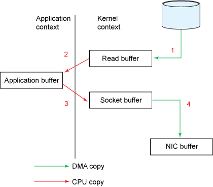
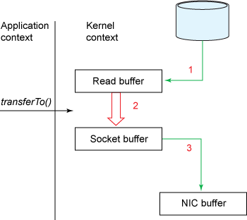
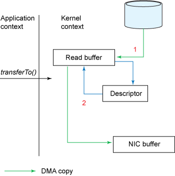

# kafka-sutdy

아래 경로읙 경우 confluentinc/cp-kafka:7.6.1의 이미지를 기반으로 진행

## 1. Kafka 실행

kafka관련 실행 파일들은 /usr/bin에 존재
설정 파일의 위치는 /etc/kafka
kafka관련 로그 파일들의 위치는 /var/lib/kafka에 존재 -> log.dirs를 통해 위치 변경 가능

kafak정보 확인 : /usr/bin/kafka-broker-api-versions.sh --bootstrap-server <ip:port>

## kafka 설명

### 확장성

카프카는 브로커 개수를 통해 간단하게 스케일 아웃을 할 수 있음(반대도 가능)

### 높은 처리량

1. 카프카는 데이터를 단건으로 처리하지 않고 묶어서 처리하기에 네트워크 비용에서 이점을 얻음(produce,conusme)
2. 파티션을 통해 데이터를 병렬로 처리
3. zero-copy 사용 - 어플리케이션까지 거치지 않고 


  
출처 : IBM 문서  

```scss
Kafka Producer   ───────▶   Kafka Broker   ───────▶   Kafka Consumer
                    (1) 메시지 저장               (4) 데이터 수신
                            │
                            ▼
                    ┌─────────────────────────────┐
                    │         Kafka Broker        │
                    │  ┌───────────────────────┐  │
                    │  │    디스크(Log 파일)    │  │
                    │  └───────────────────────┘  │
                    │           │                 │
                    │           ▼                 │
                    │   ┌─────────────────────┐   │
                    │   │ sendfile() 호출     │   │
                    │   │ (Zero-Copy 적용)    │   │
                    │   └─────────────────────┘   │
                    │           │                 │
                    │           ▼                 │
                    │   ┌─────────────────────┐   │
                    │   │  네트워크 소켓      │   │
                    │   └─────────────────────┘   │
                    └─────────────────────────────┘

(1) Producer가 메시지를 생성하고 Kafka Broker로 전송
(2) Kafka Broker는 메시지를 디스크(Log 파일)에 저장
(3) Consumer가 데이터 요청을 보내면,
(4) Kafka Broker는 `sendfile()` 시스템 호출로 디스크에서 네트워크 소켓으로 데이터를 전송 (Zero-Copy 적용)
(5) Consumer가 데이터를 네트워크를 통해 수신
```

카프카는 데이터를 파일에 저장하는데 페이지 캐시를 이용해서 저장
장점으로는 디스크에 저장하지만 메모리를 이용한 방식으로 인해 매우 빠르며 카프카 특성상 최근 데이터에 대해서 consumer들이 읽기 때문에 페이지 캐시에 있는 값을 읽을 가능성이 높음
```bash
[appuser@122412ebbaea hello2-1]$ free -mw
              total        used        free      shared     buffers       cache   available
Mem:           7807        3194        3342           7         219        1051        4383
Swap:          2048           0        2048
```
참고
페이지 캐시: 파일
버퍼 캐시: 파일 이외(메타데이터...)

### 영속성

카프카는 페이지 캐시를 적극적으로 사용하기에 파일에 직접 쓰기를 진행하더라도 더욱 빠르게 영속화할 수 있음
vm.swappiness 값은 0에서 100 사이의 정수로 설정할 수 있으며, 기본값은 60
vm.dirty_ratio 해당 비율이 넘어가는 순간 디스크 쓰기 작업 실행

> 람다 아키텍처
>
>배치 레이어 (Batch Layer):
역할: 주로 역사적 데이터를 저장하고, 주기적으로 배치 처리를 수행하여 정확하고 완전한 데이터 분석 결과를 생성합니다.
특징: 배치 처리는 지연이 발생할 수 있지만, 데이터 정확도를 보장합니다.
예시: Hadoop, Spark, Hive 등.

>스피드 레이어 (Speed Layer): 
역할: 실시간 데이터 처리를 담당하여 최신 데이터를 빠르게 반영합니다.
특징: 최신 데이터를 실시간으로 처리하여 배치 레이어의 지연을 보완합니다. 대신, 데이터의 정확도보다는 빠른 처리가 우선됩니다.
예시: Kafka Streams, Apache Storm, Apache Flink 등.

>서빙 레이어 (Serving Layer):
역할: 배치 레이어와 스피드 레이어에서 처리된 데이터를 쿼리하기 쉬운 형태로 저장하여 클라이언트 애플리케이션이 빠르게 조회할 수 있게 합니다.
특징: 배치 결과와 실시간 결과를 합쳐서 사용자에게 완전한 데이터를 제공합니다.
예시: HBase, Cassandra, Elasticsearch 등.
> 카파 아키텍처
>
> 기존  람다 아키텍처에서 배치 레이어를 없애고 스피드 레이어에서 처리하도록 한 아키텍처

### 카프카 설정
`listeners=PLAINTEXT://:9092`  
특정 호스트와 포트에서 수신하고 싶은 경우에만 설정

`advertised.listeners=PLAINTEXT://your.host.name:9092`  
어느 포트로 수신할 것인지를 설정


### 카프카 시작


#### 카프카 기본 명령어

1. topic
```bash
[appuser@122412ebbaea usr]$ kafka-topics --bootstrap-server kafka1:9092 --list

[appuser@122412ebbaea usr]$ kafka-topics --bootstrap-server kafka1:9092 --create --topic hello
Created topic hello.
[appuser@122412ebbaea usr]$ kafka-topics --bootstrap-server kafka1:9092 --list
hello
[appuser@122412ebbaea usr]$ kafka-topics --bootstrap-server kafka1:9092 --describe --topic hello
Topic: hello    TopicId: HuuxkHlKQh-YICwDb3nyQg PartitionCount: 1       ReplicationFactor: 1    Configs:
        Topic: hello    Partition: 0    Leader: 3       Replicas: 3     Isr: 3
```

2. produce , consume


3. consumer group
```bash
[appuser@122412ebbaea usr]$ kafka-consumer-groups --bootstrap-server kafka1:9092 --group group1 --describe

Consumer group 'group1' has no active members.

GROUP           TOPIC           PARTITION  CURRENT-OFFSET  LOG-END-OFFSET  LAG             CONSUMER-ID     HOST            CLIENT-ID
group1          hello           0          2               2               0               -               -               -
```
**CURRENT-OFFSET**
현재 소비자가 읽은 마지막 메시지의 오프셋입니다. 소비자가 다음으로 읽을 위치를 가리키며, 이는 소비자 그룹에서 메시지가 어디까지 처리되었는지를 나타냅니다.

**LOG-END-OFFSET:**
파티션에서 현재 끝에 있는 메시지의 오프셋

**LAG**
소비자가 읽지 않은 메시지의 수입니다. LAG는 LOG-END-OFFSET - CURRENT-OFFSET으로 계산되며, 지연을 나타냅니다.

**HOST**
소비자가 실행 중인 호스트 IP 주소

**CLIENT-ID**
소비자의 클라이언트 식별자

3. verify
```bash
[appuser@122412ebbaea usr]$ kafka-verifiable-producer --bootstrap-server kafka1:9092 --max-messages 3 --topic verify-test
{"timestamp":1731159021616,"name":"startup_complete"}
{"timestamp":1731159021783,"name":"producer_send_success","key":null,"value":"0","topic":"verify-test","partition":0,"offset":13}
{"timestamp":1731159021785,"name":"producer_send_success","key":null,"value":"1","topic":"verify-test","partition":0,"offset":14}
{"timestamp":1731159021785,"name":"producer_send_success","key":null,"value":"2","topic":"verify-test","partition":0,"offset":15}
{"timestamp":1731159021791,"name":"shutdown_complete"}
{"timestamp":1731159021792,"name":"tool_data","sent":3,"acked":3,"target_throughput":-1,"avg_throughput":16.949152542372882}

[appuser@122412ebbaea usr]$ kafka-verifiable-consumer --bootstrap-server kafka1:9092 --max-messages 3 --topic verify-test --group-id test-group
{"timestamp":1731159031965,"name":"startup_complete"}
{"timestamp":1731159035314,"name":"partitions_assigned","partitions":[{"topic":"verify-test","partition":0}]}
{"timestamp":1731159035378,"name":"records_consumed","count":16,"partitions":[{"topic":"verify-test","partition":0,"count":3,"minOffset":0,"maxOffset":2}]}
{"timestamp":1731159035404,"name":"offsets_committed","offsets":[{"topic":"verify-test","partition":0,"offset":3}],"success":true}
{"timestamp":1731159035409,"name":"partitions_revoked","partitions":[{"topic":"verify-test","partition":0}]}
{"timestamp":1731159035894,"name":"shutdown_complete"}
```

### 카프카 클러스터

`cd /var/lib/kafka/data`로 이동하면 여러개의 파일이 보이는데 일부 파일을 제외하고는 각각 파티션을 의미
```bash
drwxr-xr-x  2 appuser appuser 4096 Nov  9 13:21 hello2-1
drwxr-xr-x  2 appuser appuser 4096 Nov  9 13:50 hello3-0
drwxr-xr-x  2 appuser appuser 4096 Nov  9 13:50 hello3-1
drwxr-xr-x  2 appuser appuser 4096 Nov  9 13:50 hello3-2
```
위 목록을 보면 hello2는 1개가 있지만 hello3는 3개가 있는 것을 확인
-> hello2는 파티션 3개 replication-factor 1로 설정한 경우
-> hello3는 파티션 3개 replication-factor 3으로 설정한 경우


### 카프카 브로커
카프카는 파일에 직접 데이터를 저장

log.segment.bytes = 크기
log.segment.ms = 시간

위 설정은 **닫힌 파일**에만 적용 되며 열려있는 파일에는 적용 안됨

### 주키퍼

카프카 관련 메타데이터 관리용
```zookeper
get /brokers/ids/3
{"features":{},"listener_security_protocol_map":{"INTERNAL":"PLAINTEXT","EXTERNAL":"PLAINTEXT"},"endpoints":["INTERNAL://kafka3:29092","EXTERNAL://kafka3:9092"],"jmx_port":-1,"port":29092,"host":"kafka3","version":5,"timestamp":"1731163180710"}
get /controller
{"version":2,"brokerid":3,"timestamp":"1731163181146","kraftControllerEpoch":-1}
```

## Producer

kafkaProps.put(ProducerConfig.BOOTSTRAP_SERVERS_CONFIG, "localhost:9092,localhost:9093,localhost:9094");

**KafkaProducer.class**

### 직렬화
```java
try {
    serializedKey = this.keySerializer.serialize(record.topic(), record.headers(), record.key());
} catch (ClassCastException var21) {
    ClassCastException cce = var21;
    throw new SerializationException("Can't convert key of class " + record.key().getClass().getName() + " to class " + this.producerConfig.getClass("key.serializer").getName() + " specified in key.serializer", cce);
}
```

### 배치 저장
```java
boolean abortOnNewBatch = this.partitioner != null;
RecordAccumulator.RecordAppendResult result = this.accumulator.append(record.topic(), partition, timestamp, serializedKey, serializedValue, headers, appendCallbacks, remainingWaitMs, abortOnNewBatch, nowMs, cluster);
            if (result.abortForNewBatch) {
                int prevPartition = partition;
``` 
위 코드를 통해 배치에 저장 -> 이후 배치 단위로 send
배치가 꽉차면 


```java
if (result.batchIsFull || result.newBatchCreated) {
    this.log.trace("Waking up the sender since topic {} partition {} is either full or getting a new batch", record.topic(), appendCallbacks.getPartition());
    this.sender.wakeup();
}
```
배치가 꽉차 있으므로 send 호출

내부 구현은 nio 기반의 non-block io로 되어 있음

**NetworkClient.class**
```java
public List<ClientResponse> poll(long timeout, long now) {
        this.ensureActive();
        if (!this.abortedSends.isEmpty()) {
            List<ClientResponse> responses = new ArrayList();
            this.handleAbortedSends(responses);
            this.completeResponses(responses);
            return responses;
        } else {
            long metadataTimeout = this.metadataUpdater.maybeUpdate(now);
            long telemetryTimeout = this.telemetrySender != null ? this.telemetrySender.maybeUpdate(now) : 2147483647L;

            try {
                this.selector.poll(Utils.min(timeout, new long[]{metadataTimeout, telemetryTimeout, (long)this.defaultRequestTimeoutMs}));
            } catch (IOException var12) {
                IOException e = var12;
                this.log.error("Unexpected error during I/O", e);
            }

            long updatedNow = this.time.milliseconds();
            List<ClientResponse> responses = new ArrayList();
            this.handleCompletedSends(responses, updatedNow);
            this.handleCompletedReceives(responses, updatedNow);
            this.handleDisconnections(responses, updatedNow);
            this.handleConnections();
            this.handleInitiateApiVersionRequests(updatedNow);
            this.handleTimedOutConnections(responses, updatedNow);
            this.handleTimedOutRequests(responses, updatedNow);
            this.completeResponses(responses);
            return responses;
        }
    }
```
실제로 poll을 통해 이벤트를 감지 실제 데이터를 보내는 곳은 handle 부분

```java
 private void handleCompletedSends(List<ClientResponse> responses, long now) {
        Iterator var4 = this.selector.completedSends().iterator();

        while(var4.hasNext()) {
            NetworkSend send = (NetworkSend)var4.next();
            InFlightRequest request = this.inFlightRequests.lastSent(send.destinationId());
            if (!request.expectResponse) {
                this.inFlightRequests.completeLastSent(send.destinationId());
                responses.add(request.completed((AbstractResponse)null, now));
            }
        }

    }
```
이벤트 감지된 목록을 가져와서 처리

### 옵션
`kafkaProps.put(ProducerConfig.MAX_IN_FLIGHT_REQUESTS_PER_CONNECTION,1);`
순서를 보장해야 한다면 파티션 1개에 위 옵션을 설정


### 생각해 볼 점
buffer.memory의 경우 크기가 크면 오히려 좋지 않을까?
batch.size는 어느 정도가 적합한지 알 수 있을 까?


## Consumer

`auto.offset.reset`
```PLAINTEXT
earliest: automatically reset the offset to the earliest offset
latest: automatically reset the offset to the latest offset
none: throw exception to the consumer if no previous offset is found for the consumer's group
anything else: throw exception to the consumer.
```

기본 값은 latest

### rebalancing

컨슈머 그룹중 일부 컨슈머가 에러가 발생하면 리밸런싱이 일어난다.
__consumer_offset에 파티션과 오프셋과 관련한 정보가 들어있다.


### auto commit
```java
    Properties prop = new Properties();
    prop.put(ConsumerConfig.BOOTSTRAP_SERVERS_CONFIG, "localhost:9092,localhost:9093,localhost:9094");
    prop.put(ConsumerConfig.GROUP_ID_CONFIG, GROUP_ID);
    prop.put(ConsumerConfig.KEY_DESERIALIZER_CLASS_CONFIG, StringDeserializer.class.getName());
    prop.put(ConsumerConfig.VALUE_DESERIALIZER_CLASS_CONFIG, StringDeserializer.class.getName());
    prop.put(ConsumerConfig.AUTO_OFFSET_RESET_CONFIG, "earliest");
    prop.put(ConsumerConfig.MAX_POLL_RECORDS_CONFIG, 1);
    prop.put(ConsumerConfig.ENABLE_AUTO_COMMIT_CONFIG, false);
```
auto commit false로 설정한 경우 여러 컨슈머에서 같은 그룹 ID를 사용하더라도 commit이 안되었기에 각자 가져오게 된다.

